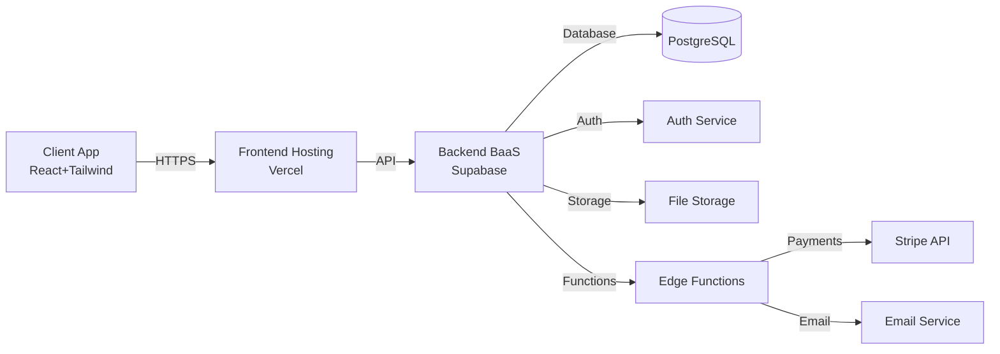

# Architektura i Technologie

## Spis Treści

1. [Wprowadzenie](#wprowadzenie)
2. [Przegląd Architektury](#przegląd-architektury)
3. [Technologie Frontendowe](#technologie-frontendowe)
4. [Technologie Backendowe](#technologie-backendowe)
5. [Usługi Zewnętrzne i Integracje](#usługi-zewnętrzne-i-integracje)
6. [Infrastruktura i DevOps](#infrastruktura-i-devops)
7. [Bezpieczeństwo](#bezpieczeństwo)
8. [Diagram Architektury](#diagram-architektury)
9. [Strategia Skalowania](#strategia-skalowania)
10. [Podsumowanie Technologiczne](#podsumowanie-technologiczne)

---

## Wprowadzenie

Niniejszy dokument przedstawia szczegółowy przegląd architektury technologicznej platformy EduSync. Dokument opisuje wybór technologii, uzasadnienie decyzji architektonicznych oraz integracje z usługami zewnętrznymi.

**Zasady przewodnie:**

- **Prostota** — wybieramy sprawdzone, popularne technologie
- **Skalowalność** — architektura musi obsłużyć wzrost liczby użytkowników
- **Bezpieczeństwo** — ochrona danych użytkowników jest priorytetem
- **Koszt-efektywność** — optymalizacja kosztów przy zachowaniu jakości

---

## Przegląd Architektury

### Model Aplikacji

EduSync jest aplikacją **SPA (Single Page Application)** z backend-as-a-service (BaaS), co oznacza:

- Cały interfejs użytkownika ładuje się jednorazowo
- Komunikacja z serwerem odbywa się przez API
- Stan aplikacji zarządzany lokalnie (client-side)
- Backend oparty na usługach chmurowych (Supabase)

### Wzorce Architektoniczne

| Wzorzec | Zastosowanie |
|---------|--------------|
| **Client-Server** | Frontend (React) ↔ Backend (Supabase) |
| **RESTful API** | Komunikacja przez REST/GraphQL |
| **Serverless** | Edge Functions dla logiki biznesowej |
| **Event-Driven** | Webhooks dla powiadomień |

---

## Technologie Frontendowe

### 3.1. React

| Aspekt | Opis |
|--------|------|
| **Wersja** | React 18+ (z Concurrent Mode) |
| **Język** | TypeScript |
| **Dlaczego?** | Najpopularniejszy framework, ogromna społeczność, bogaty ekosystem |
| **Korzyści** | Komponentowy model, wirtualny DOM, hooks API |

**Struktura projektu:**

```
src/
├── components/       # Komponenty React
├── pages/           # Strony aplikacji
├── hooks/           # Custom hooks
├── services/        # Serwisy API
├── store/           # Stan aplikacji (Zustand/Redux)
├── utils/           # Funkcje pomocnicze
└── types/           # Definicje TypeScript
```

### 3.2. Tailwind CSS

| Aspekt | Opis |
|--------|------|
| **Wersja** | Tailwind CSS 3.x |
| **Dlaczego?** | Szybki rozwój, brak konfliktu klas, mały rozmiar bundle |
| **Korzyści** | Spójny design system, responsywność out-of-the-box |

**Konfiguracja:**

- Customowy config z design tokens (kolory, fonty, spacing)
- Komponenty zgodne z WCAG (dostępność)
- Dark mode support

### 3.3. Vite

| Aspekt | Opis |
|--------|------|
| **Wersja** | Vite 5.x |
| **Dlaczego?** | Błyskawiczny dev server, szybki build |
| **Korzyści** | HMR (Hot Module Replacement), optymalizacje produkcyjne |

### 3.4. Dodatkowe Biblioteki Frontendowe

| Biblioteka | Zastosowanie |
|------------|--------------|
| **React Router** | Routing aplikacji |
| **React Query** | Zarządzanie stanem serwerowym (caching, synchronizacja) |
| **Zustand** | Globalny stan aplikacji (lokalny) |
| **React Hook Form** | Formularze z walidacją |
| **Zod** | Walidacja schematów danych |
| **date-fns** | Operacje na datach |
| **React Calendar** | Komponent kalendarza |
| **Recharts** | Wykresy i wykresy |
| **React Email** | Szablony email |

---

## Technologie Backendowe

### 4.1. Supabase

| Aspekt | Opis |
|--------|------|
| **Usługa** | Backend-as-a-Service (BaaS) |
| **Baza danych** | PostgreSQL |
| **Dlaczego?** | Open-source'owy Firebase alternative, silny PostgreSQL |
| **Korzyści** | Auth, Database, Storage, Edge Functions, Realtime |

**Moduły Supabase:**

| Moduł | Zastosowanie |
|-------|--------------|
| **PostgreSQL** | Główna baza danych |
| **Auth** | Uwierzytelnianie użytkowników (JWT) |
| **Storage** | Przechowywanie plików (avatars, materials) |
| **Edge Functions** | Serverless functions (logika biznesowa) |
| **Realtime** | Live aktualizacje (chat, kalendarz) |
| **Row Level Security** | Bezpieczeństwo na poziomie wierszy |

### 4.2. Schema Bazy Danych

#### Główne tabele:

```sql
-- Użytkownicy (rozszerzenie auth.users)
profiles (
  id UUID PRIMARY KEY,
  user_id UUID REFERENCES auth.users,
  email VARCHAR,
  first_name VARCHAR,
  last_name VARCHAR,
  phone VARCHAR,
  avatar_url TEXT,
  role ENUM('tutor', 'student', 'owner', 'admin'),
  created_at TIMESTAMP,
  updated_at TIMESTAMP
)

-- Szkoły (dla właścicieli)
organizations (
  id UUID PRIMARY KEY,
  name VARCHAR,
  nip VARCHAR,
  address TEXT,
  owner_id UUID REFERENCES profiles,
  created_at TIMESTAMP
)

-- Uczniowie
students (
  id UUID PRIMARY KEY,
  organization_id UUID REFERENCES organizations,
  first_name VARCHAR,
  last_name VARCHAR,
  email VARCHAR,
  phone VARCHAR,
  notes TEXT,
  created_at TIMESTAMP
)

-- Zajęcia
lessons (
  id UUID PRIMARY KEY,
  organization_id UUID REFERENCES organizations,
  tutor_id UUID REFERENCES profiles,
  student_id UUID REFERENCES students,
  scheduled_at TIMESTAMP,
  duration_minutes INTEGER,
  status ENUM('scheduled', 'completed', 'cancelled'),
  topic VARCHAR,
  notes TEXT,
  created_at TIMESTAMP
)

-- Faktury
invoices (
  id UUID PRIMARY KEY,
  organization_id UUID REFERENCES organizations,
  student_id UUID REFERENCES students,
  invoice_number VARCHAR,
  amount DECIMAL,
  vat_amount DECIMAL,
  status ENUM('pending', 'paid', 'overdue', 'cancelled'),
  due_date DATE,
  paid_at TIMESTAMP,
  created_at TIMESTAMP
)

-- Płatności
payments (
  id UUID PRIMARY KEY,
  invoice_id UUID REFERENCES invoices,
  amount DECIMAL,
  payment_method VARCHAR,
  stripe_payment_id VARCHAR,
  status VARCHAR,
  created_at TIMESTAMP
)
```

---

## Usługi Zewnętrzne i Integracje

### 5.1. Stripe

| Aspekt | Opis |
|--------|------|
| **Usługa** | Płatności online |
| **Produkty** | Checkout, Payment Intents, Customer Portal |
| **Dlaczego?** | Najpopularniejsza bramka płatności, świetne API, polska waluta |

**Integracje:**

- **Stripe Checkout** — bezpieczne strony płatności
- **Stripe Customer Portal** — self-service dla uczniów
- **Webhooks** — powiadomienia o płatnościach
- **Stripe Sigma** — analityka płatności

### 5.2. Email (SendGrid / Resend)

| Aspekt | Opis |
|--------|------|
| **Usługa** | Wysyłka email transakcyjnych |
| **Dlaczego?** | Niezawodność, dostarczalność, API |
| **Alternatywy** | SendGrid, Mailgun, AWS SES |

**Typy emaili:**

- Potwierdzenie rejestracji
- Przypomnienie o zajęciach
- Faktury i faktury
- Powiadomienia o płatnościach

### 5.3. Kalendarze Zewnętrzne

| Integracja | Opis |
|------------|------|
| **Google Calendar** | Synchronizacja dwukierunkowa |
| **Outlook Calendar** | Synchronizacja przez CalDAV |
| **Apple Calendar** | Synchronizacja przez CalDAV |

---

## Infrastruktura i DevOps

### 6.1. Hosting

| Usługa | Zastosowanie |
|--------|--------------|
| **Vercel** | Hosting frontend (SPA) |
| **Supabase** | Backend (baza danych, auth, functions) |
| **AWS S3 / Supabase Storage** | Pliki statyczne |

### 6.2. CI/CD

| Narzędzie | Zastosowanie |
|-----------|--------------|
| **GitHub Actions** | CI/CD pipeline |
| **Lint + Prettier** | Code quality |
| **ESLint** | Linting |
| **Vitest** | Testy jednostkowe |

**Pipeline:**

1. Push do branch → GitHub Actions uruchamia
2. Lint + TypeScript check
3. Testy jednostkowe
4. Build produkcyjny
5. Deploy do Vercel (preview + production)

### 6.3. Monitoring

| Narzędzie | Zastosowanie |
|-----------|--------------|
| **Sentry** | Error tracking |
| **Vercel Analytics** | Web analytics |
| **Supabase Dashboard** | Monitoring bazy |

---

## Bezpieczeństwo

### 7.1. Uwierzytelnianie

| Mechanizm | Opis |
|-----------|------|
| **JWT** | Tokeny z krótkim czasem życia |
| **OAuth 2.0** | Logowanie przez Google, Apple |
| **2FA** | Opcjonalne (TOTP) |
| **RLS** | Row Level Security w Supabase |

### 7.2. Ochrona Danych

| Mechanizm | Opis |
|-----------|------|
| **HTTPS** | Obowiązkowe |
| **Szyfrowanie** | AES-256 dla danych w spoczynku |
| **Backupy** | Codzienne automatyczne |
| **RODO** | Zgodność z GDPR |

### 7.3. Walidacja Danych

| Mechanizm | Opis |
|-----------|------|
| **Zod** | Walidacja schematów po stronie klienta |
| **Edge Functions** | Walidacja po stronie serwera |
| **Parametryzowane zapytania** | Ochrona przed SQL injection |

---

## Diagram Architektury

### Architektura Systemu EduSync



**Opis węzłów:**

| Węzeł | Opis |
|-------|------|
| **Client App** | Aplikacja React z Tailwind CSS |
| **Frontend Hosting** | Vercel - CDN i serwowanie SPA |
| **Backend BaaS** | Supabase - API, baza, auth |
| **PostgreSQL** | Główna baza danych |
| **Auth Service** | Uwierzytelnianie JWT |
| **File Storage** | Przechowywanie plików |
| **Edge Functions** | Serverless functions |
| **Stripe API** | Płatności online |
| **Email Service** | Wysyłka emaili |

---

## Strategia Skalowania

### Poziomy Skalowania

| Poziom | Użytkownicy | Architektura |
|--------|-------------|--------------|
| **Startup** | 0-1,000 | Podstawowa konfiguracja Supabase |
| **Growth** | 1,000-10,000 | Optymalizacja zapytań, caching |
| **Scale** | 10,000-100,000 | Sharding, CDN, load balancing |
| **Enterprise** | 100,000+ | Multi-region, dedykowana infrastruktura |

### Optymalizacje

| Technika | Zastosowanie |
|----------|--------------|
| **Caching** | React Query + IndexedDB |
| **Lazy Loading** | Import dynamiczny komponentów |
| **Pagination** | Pobieranie danych w chunks |
| **Indexy** | Indeksy w PostgreSQL |
| **CDN** | Vercel Edge Network |

---

## Podsumowanie Technologiczne

### Stack Technologiczny

| Warstwa | Technologie |
|---------|-------------|
| **Frontend** | React 18, TypeScript, Tailwind CSS, Vite |
| **State Management** | React Query, Zustand |
| **Backend** | Supabase (PostgreSQL, Auth, Edge Functions) |
| **Płatności** | Stripe |
| **Email** | Resend / SendGrid |
| **Hosting** | Vercel |
| **CI/CD** | GitHub Actions |
| **Monitoring** | Sentry, Vercel Analytics |

### Matryca Decyzji

| Kryterium | Wybór | Uzasadnienie |
|-----------|-------|--------------|
| **Frontend Framework** | React | Dominacja rynkowa, ekosystem |
| **Styling** | Tailwind CSS | Szybkość, spójność |
| **Backend** | Supabase | BaaS, PostgreSQL, realtime |
| **Płatności** | Stripe | Najlepsze API, polska waluta |
| **Hosting** | Vercel | Optymalizacja dla SPA |
| **Auth** | Supabase Auth | Integracja z bazą |

---

## Następne Kroki

1. [ ] Konfiguracja projektu React z Vite
2. [ ] Setup Supabase (baza, auth, storage)
3. [ ] Połączenie Stripe
4. [ ] Implementacja pierwszych User Stories
5. [ ] Deployment produkcyjny

---

*Document Version: 1.0*  
*Last Updated: 2025*  
*Author: Technical Architecture Team*  
*Status: Approved for Implementation*
